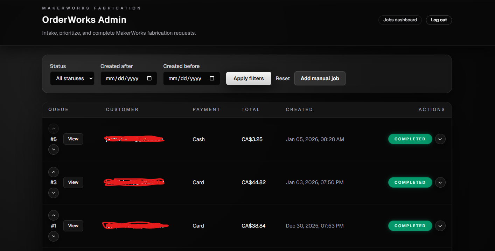
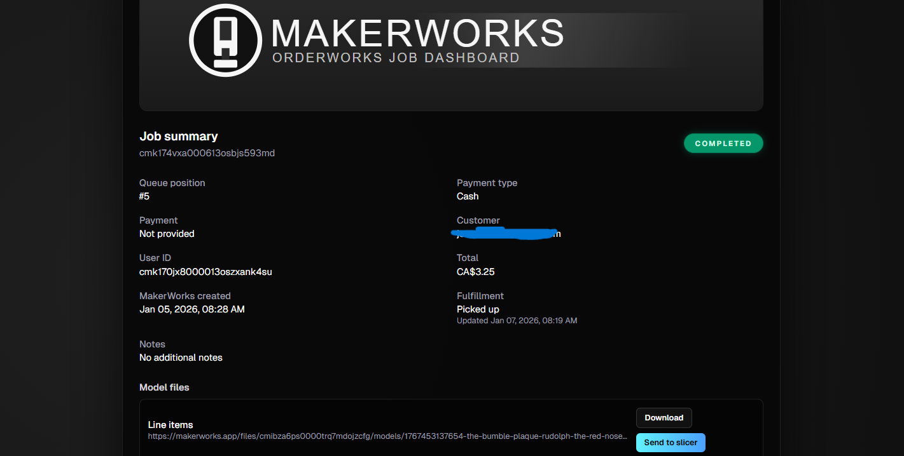

# OrderWorks

OrderWorks is a simple dashboard for 3D printing jobs. It pulls jobs from MakerWorks, keeps a working copy with queue notes, and lets your team review and complete work from one screen.

## Screenshots

Dashboard view:


Job detail view:


## Why this is helpful

When every job is on a shared display, the whole shop stays in sync. It is easier to:
- See what needs to be printed right now.
- Avoid missed or duplicate prints.
- Spot rush jobs and bottlenecks quickly.
- Keep front desk, printing, and fulfillment aligned on the same status.

## How it connects to MakerWorks and StockWorks

- MakerWorks is the source of jobs. OrderWorks reads those jobs from the MakerWorks database and keeps its own queue and notes in the `orderworks` schema.
- StockWorks can show the OrderWorks queue too:
  - If StockWorks points its `DATABASE_URL` to the same MakerWorks database, it reads from `orderworks.jobs` directly.
  - If StockWorks cannot reach that database, it can use the OrderWorks HTTP login instead (see its README for `ORDERWORKS_BASE_URL`, `ORDERWORKS_ADMIN_USERNAME`, and `ORDERWORKS_ADMIN_PASSWORD`).
- OrderWorks does not need any extra settings for StockWorks.

## What you need

- A MakerWorks Postgres database (Postgres 15.x is the tested target).
- Node.js 20+ if you are running the app directly on a computer.
- Admin login details for the OrderWorks dashboard.

## Quick start (local setup)

1) Install dependencies:
```bash
npm install
```

2) Set up your environment file:
- Copy `.env.example` to `.env`.
- Fill in the values below (see explanations).

3) Generate the database client:
```bash
npm run db:generate
```

4) Apply database migrations:
```bash
npm run db:migrate
```

5) Start the app:
```bash
npm run dev
```

Open the dashboard at `http://localhost:3000`.

## Environment variables (plain English)

Put these in `.env` or your hosting platform’s settings.

Required:
- `DATABASE_URL`: The MakerWorks Postgres connection string. OrderWorks reads jobs from here and stores its own queue data in the `orderworks` schema.
- `ADMIN_USERNAME`: The username for the admin login.
- `ADMIN_PASSWORD`: The password for the admin login.
- `ADMIN_SESSION_SECRET`: A long random string that signs login sessions. Change it to log everyone out.

Used for Docker Compose only:
- `DOCKER_DATABASE_URL`: The database connection string used by `docker-compose.yml`.

Email receipts (optional):
- `RECEIPT_FROM_EMAIL`: The “From” address shown on completion emails.
- `RECEIPT_REPLY_TO_EMAIL`: Optional reply-to address.
- `RESEND_API_KEY`: Use this if you send mail via Resend.
- `SMTP_HOST`, `SMTP_PORT`, `SMTP_USER`, `SMTP_PASSWORD`, `SMTP_SECURE`: Use these if you send mail via SMTP instead of Resend.

Docker startup (optional):
- `SKIP_DB_MIGRATE`: Set to `1` to skip automatic migrations in the Docker entrypoint.

## Using the dashboard

- Go to `/login` and sign in with your admin username/password.
- The main dashboard is at `/`.
- Filter jobs by status or date.
- Open a job to review details and mark it complete.
- Reorder jobs in the queue with the Move Up / Move Down controls.
- Use **Send to slicer** to open Bambu Studio on the viewing workstation.

## Email receipts

When a job is marked completed, OrderWorks can send a receipt email. To enable this, you must set:
- `RECEIPT_FROM_EMAIL`
- Either `RESEND_API_KEY` or the SMTP variables

If those are missing, completing a job that needs email will fail until you configure them.

## Docker Compose (optional)

If you prefer containers, you can run everything with Docker:
```bash
docker compose up --build
```

This runs:
- `db`: a Postgres 15 container with a `makerworks` database and `orderworks` schema.
- `app`: the OrderWorks dev server on `http://localhost:3001`.

## Docker / Unraid deployment (optional)

A production-ready `Dockerfile` is included. The container runs migrations on startup unless you set `SKIP_DB_MIGRATE=1`.

Unraid users can import the template at `unraid/orderworks.xml` and fill in the same environment variables.

## MakerWorks database access

The only MakerWorks-side requirement is that the OrderWorks database user can read `public.jobs`. The default `postgres` user already can.

## Need help?

Check the `docs/` folder for extra deployment notes or ask your team for the MakerWorks database connection details.
